# miniL2025 Misc官方题解

## 麦霸评分

### 预期题解

选手可以直接F12下载播放的原音频，找到比对音频的请求接口是compare-recording，再把原音频发送比对，脚本模拟请求
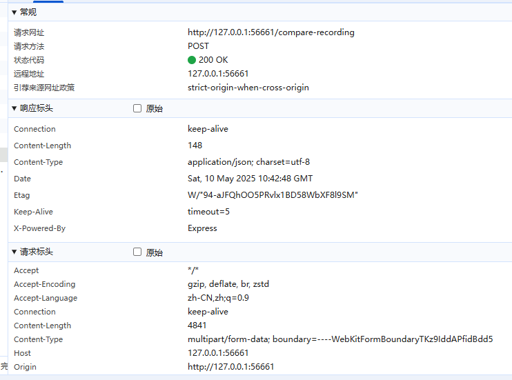

```python
import requests

def send_audio_file(file_path):

    url = ''#你的wsrx映射的地址 如http://127.0.0.1:55650/compare-recording

    with open(file_path, 'rb') as audio_file:
        files = {'audio': (file_path, audio_file, 'audio/wav')}
        response = requests.post(url, files=files)

    print("Status Code:", response.status_code)
    print("Response Text:", response.text)

    try:
        print("Response JSON:", response.json())
    except requests.exceptions.JSONDecodeError as e:
        print(f"Error parsing JSON: {e}")


if __name__ == "__main__":

    audio_file_path = r''#你的original音频文件路径
    send_audio_file(audio_file_path)
```
运行即得：
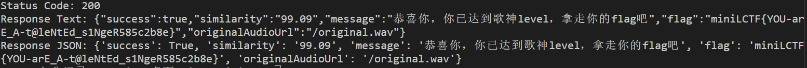

## 吃豆人

### 预期题解

查看源代码里的js代码，发现以下片段：

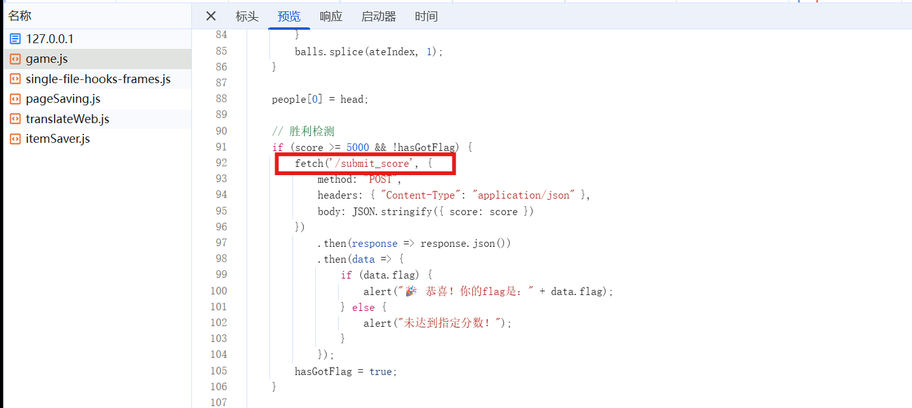

所以只要向`/submit_score`用POST方式发送score=10000就可以了

```python
import requests

def send_score():
    score = 5000

    url = 'http://127.0.0.1:51845/submit_score'  #注意查找接口

    response = requests.post(url, json={"score": score})

    data = response.json()
    print(data)

if __name__ == "__main__":
    send_score()
```

flag是`miniLCTF{THl5_g4mE-So-eASy-R1GhT?227664ceb}`
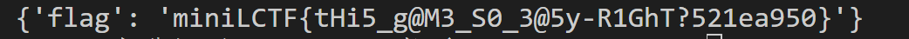

## MiniForensics I

先把桌面上的b.txt和流量包拖出来。

b.txt里面是一堆坐标，画出来长这样，排除b直接画出来是flag


最底下有两条像下划线一样的和大括号的尖端，考虑和flag有关，再找找

按照题目描述，一些藏东西的小技术，考虑到隐藏文件夹，然后进入虚拟机的此电脑，

法一：
把选项卡上”隐藏的项目“勾选掉，再勾选掉`查看->选项->查看->隐藏受保护的系统文件`

法二：
`控制面板->外观和个性化->文件资源管理器选项->显示隐藏的文件夹`

在几个主要 目录里面去找，发现`文档->nihao->ai.rar & pwd.txt`

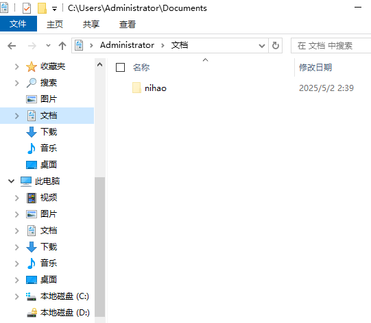

在`nihao`文件夹里有一个ai.rar和pwd.txt，pwd.txt里面说密码由7位数字组成，用ARCHPR/passwareKitForensic爆破出来密码是`1846287`
//注意这里ARCHPR的版本得新一点，版本为4.66（旧版本爆不了rar5）

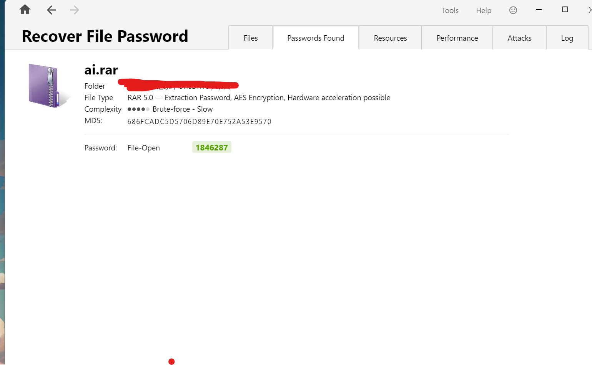

法一：
winrar可以直接检测到ssl.log，密码输进去就可以得到ssl.log


法二：
7zip检测不到ssl.log，是因为rar5里和ssl.log部分相关的serviceblock被改了，需要重新调整，点到hahahah.txt观察到右侧ascii部分可以看到ssl.log，但为什么识别不出来，再去搜rar5的结构，发现ssl.log识别不出来是因为headertype部分不对，应该把serviceheader变成fileheader，即03变02，变完之后编译，重新更改新的crc校验值，再打开就可以看到完整的压缩包了

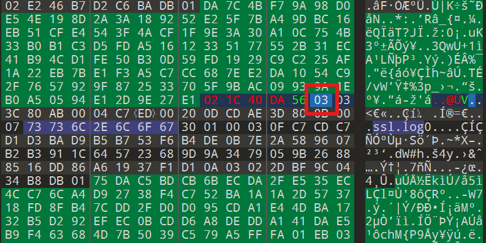


有了ssl.log之后，结合II中的提示`SSLKEYLOGFILE`环境变量，上网搜索可知ssl.log可以用来解密加密过的TLS流量

打开Wireshark，打开`编辑->首选项->Protocols->TLS->(Pre)-Master-Secret log filename`，选择刚刚的ssl.log

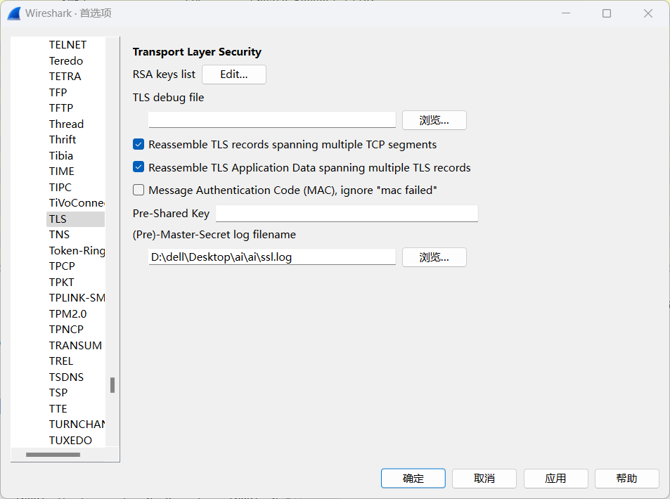

然后就会发现报文可以正常看到Decrypted TLS的信息

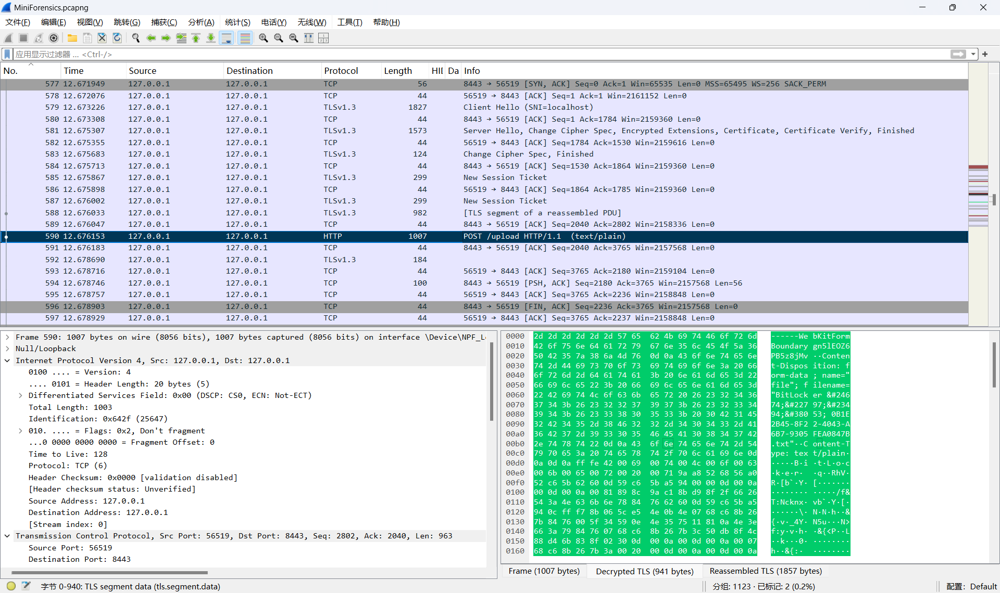

找到upload的http流量，然后追踪流->TLS Stream

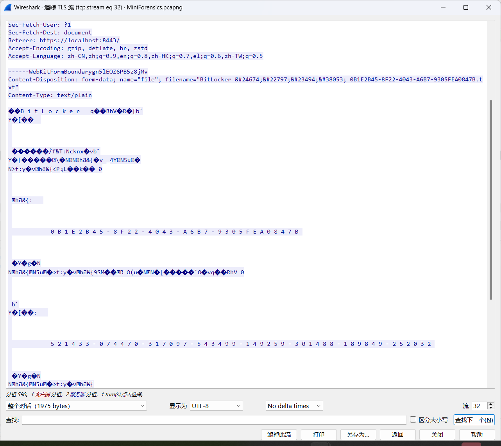

下面那个48位数字的就是D盘Bitlocker密钥

`521433-074470-317097-543499-149259-301488-189849-252032`

点击D盘，在提示框中点击‘更多选项’，然后输入密钥


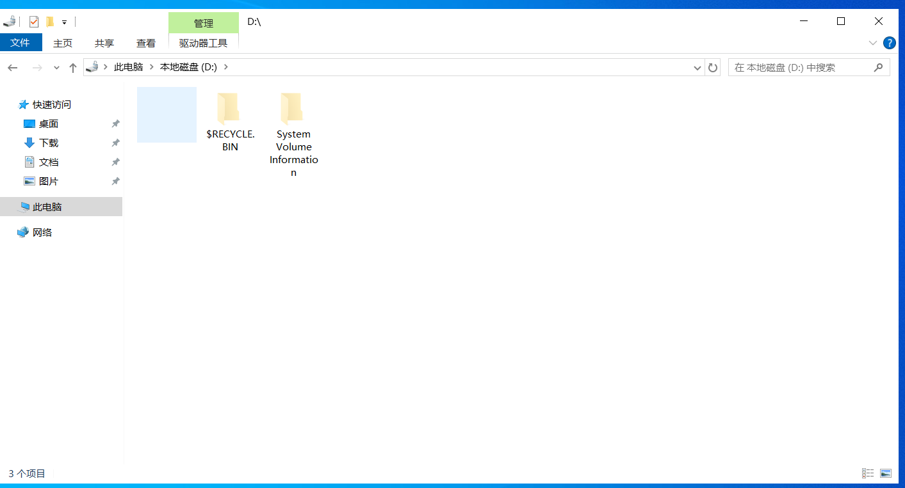

发现有一个c.txt

把c.txt画出来可以得到提示

```python
from PIL import Image
xx=[]
yy=[]
with open (r'b.txt','r') as f:
    dat=f.read().split()
    for p in dat:
        p=p.split(',')
        xy=(int(float(p[0])*2),int(float(p[1])*2))
        xx.append(xy[0])
        yy.append(xy[1])
width=max(xx)-min(xx)+1
height=max(yy)-min(yy)+1
print(width)
print(height)
x0=min(xx)
y0=min(yy)
print(x0)
print(y0)
img=Image.new('RGB',(width,height))
for i in range(len(xx)):
    try:
        img.putpixel((xx[i]-x0,yy[i]-y0),(255,255,255))
    except IndexError:
        print((xx[i],yy[i]))
img.save('flag_fake.png')
img.show()
```


易得 $ a=2b-c $，将a计算出来在画图即可得到flag

```python
# a = 2 * b - c
bx=[]
by=[]
cx=[]
cy=[]
with open (r'b.txt','r') as f:
    dat=f.read().split()
    for p in dat:
        p=p.split(',')
        bx.append(float(p[0]))
        by.append(float(p[1]))
with open (r'c.txt','r') as f:
    dat=f.read().split()
    for p in dat:
        p=p.split(',')
        cx.append(float(p[0]))
        cy.append(float(p[1]))
ax=[]
ay=[]
for i in range(len(cx)):
    try:
        ax.append(int(2*bx[i]-cx[i]))
    except IndexError:
        print(i)
for i in range(len(cx)):
    ay.append(int(2*by[i]-cy[i]))
width=max(ax)-min(ax)+1
height=max(ay)-min(ay)+1
print(width)
print(height)
x0=min(ax)
y0=min(ay)
print(x0)
print(y0)
img=Image.new('RGB',(width,height))
for i in range(len(ax)):
    try:
        img.putpixel((ax[i]-x0,ay[i]-y0),(255,255,255))
    except IndexError:
        print((ax[i],ay[i]))
img.save('flag.png')
img.show()
```


flag是`miniLCTF{forens1c5_s0ooooo_1nt4resting}`

## MiniForensicsⅡ
TLS 流量如上文解密后，得到lock.zip后发现没有任何的密码提示，但是我们会发现压缩包加密方式为ZipCrypto，文件里有一张png图片，可以想到明文攻击，明文攻击至少需要某一个文件的至少12字节，而png图片的前十六字节都是相同的，故可以伪造有一张a.png,只填充前16字节`89 50 4E 47 0D 0A 1A 0A 00 00 00 0D 49 48 44 52`进行明文攻击

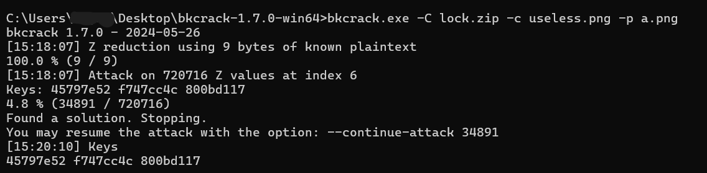
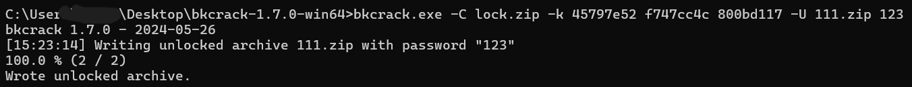

可以得到`breadcrumb.txt`，其中的密文通过base64解密后，得到`https://github.com/root-admin-user/what_do_you_wanna_find.git`

访问该git仓库，发现没有什么实际可用的txt,png只有一个py看着正常一些，运行得到hash值
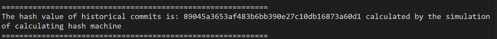
`89045a3653af483b6bb390e27c10db16873a60d1`  看输出提示是 historical commits ，结合题目背景在git仓库

考虑到是代码修改历史的hash值，但在这个仓库里面，没有找到和这个前几位相同的hash值，直接点commits，把这个hash复制到url里面，发现secret.py，运行即得flag


此题后部分的commit值借鉴到了：Git Commit的设计理念，即使fork后仓库被删除，但其commit记录仍可通过fork的主仓库去查询；